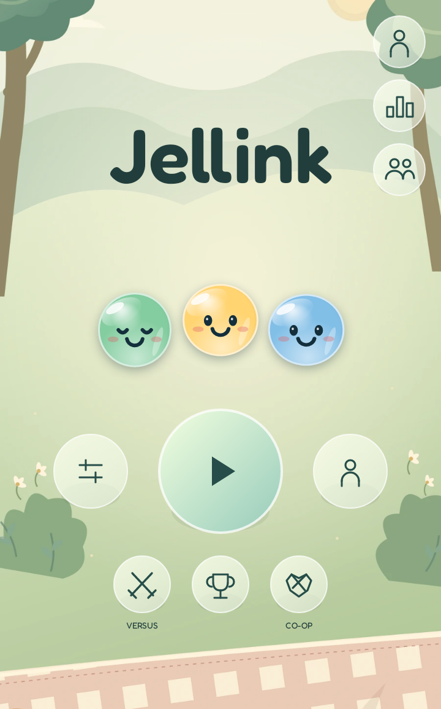
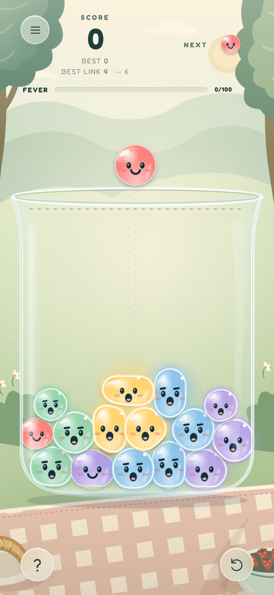
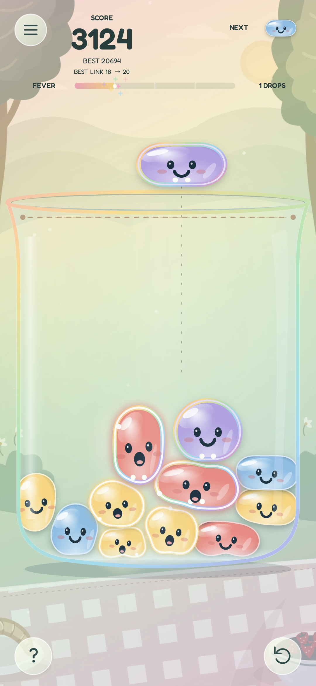

# Jellink

**A little squish. A bigger link. One more try.**

A physics puzzle by **Medissl**. Drop glossy jellies into a glass jar, build a crowd, and choose when to pop it.

[Play in your browser](https://jellink.vercel.app/play/) · [Download Android](https://jellink.vercel.app/#download) · [Download v0.8.0 APK](https://github.com/medissl/jellink/releases/download/v0.8.0/Jellink-0.8.0.apk) · [All releases](https://github.com/medissl/jellink/releases)

| Menu | Gameplay | Jelly Fever |
| :---: | :---: | :---: |
|  |  |  |

## Your little jar

Tap to drop, or hold and drag to aim. Slide up into × to cancel. Match three of one color, then tap to pop. Bigger Blooms bring happier faces, stronger bursts and satisfying chains. Fever delivers four special double-link jellies. Keep your pile below the dotted line; you get one rescue drop when it gets too high.

Soft physics, three jelly sizes, round/wide/tall shapes, Picnic and Minimal themes, original music and sounds. Solo works offline with local saves. Updates keep your existing progress.

## A little more to enjoy

Current release: **0.8.0**, signed native Android. Your existing local progress is preserved.

### A little company

Optional online play adds **Versus** (two jars, the same jelly sequence, a three-minute score race) and **Co-op** (one shared jar, alternating drops). Guest play needs no email. Your guest profile stays on this device. Add friends with their code, accept or reject requests, and compare server-verified Versus scores in your friend leaderboard. Solo remains separate.

There are 38 achievements with unlock dates, optional gentle haptics, and a result card you can share after losing. No ads. No currency shop.

## Install Android

1. Download the APK from an [official release](https://github.com/medissl/jellink/releases).
2. Allow installation from your browser when Android asks.
3. Open Jellink. For updates, install the new APK over the existing app; do not uninstall first if you want to keep progress.

Each release includes a SHA-256 checksum. The app is native Android with native physics, drawing and audio; it does not use a WebView.

## Built by Medissl

**[Visit the Jellink website](https://jellink.vercel.app)** · **[Play the browser game](https://jellink.vercel.app/play/)** · [More projects](https://github.com/medissl)

Jellink is an original game and a portfolio project: gameplay design, a custom physics simulation, procedural jelly rendering, original audio, a native Android app, and its download website. The project grew through hands-on playtesting and iteration on controls, physics, difficulty and feedback.

### Tech stack

| Part | Built with |
| --- | --- |
| Browser game | JavaScript, HTML, CSS and Canvas 2D; Vite |
| Native Android | Java, Android Canvas, SoundPool / MediaPlayer; Gradle, Java 21, Android SDK 36 |
| Physics and visuals | Custom 2D collision and pressure-based jelly deformation; shared gameplay rules in browser and Android |
| Local progress | Browser local storage; Android SharedPreferences; no account needed for solo |
| Optional online play | Supabase Auth, Postgres and an authenticated Edge Function using the game engine |
| Website hosting | Vercel, connected to the private source repository |
| Releases and testing | GitHub Actions, native unit tests and Android emulator checks; signed APKs with SHA-256 checksums |
| Typography | Fredoka, licensed under SIL OFL |

### How it works

Jelly bodies react to gravity, impacts, neighbouring weight and curved glass boundaries. Their rendered surfaces deform with contact pressure while the collision solver maintains a stable pile. Three sizes and three rounded shapes change how pieces settle. Matching crowds grow through ten Bloom milestones, and larger pops can trigger sequential chain reactions.

Solo keeps its progress on the device. Online matches use server-verified moves and scores, with local prediction for immediate feedback. Versus uses the same seeded ordinary jelly sequence in both jars; Co-op uses one shared jar with alternating drops. Online matches restore the solo jar when you leave and do not overwrite local records.

The APK draws and plays the game natively. It does not package a browser or use a WebView. Its compact size comes from native drawing, compact artwork and bundled audio.

### Documentation

- [Game guide](docs/game-guide.md): controls, crowds, Fever and rescue drops.
- [Project overview](docs/project-overview.md): architecture, development decisions and verification.
- [Release notes and official downloads](https://github.com/medissl/jellink/releases).

## Official distribution

This public repository contains screenshots, releases, checksums and release notes. The source repository is private. Download links stay public.

Copyright © 2026 Medissl. All rights reserved. You may play official builds and share gameplay/screenshots. Republishing the game, source, artwork, audio or branding requires permission; see [LICENSE](LICENSE). Third-party rights remain with their owners; [Fredoka uses the SIL OFL](licenses/OFL-Fredoka.txt).
